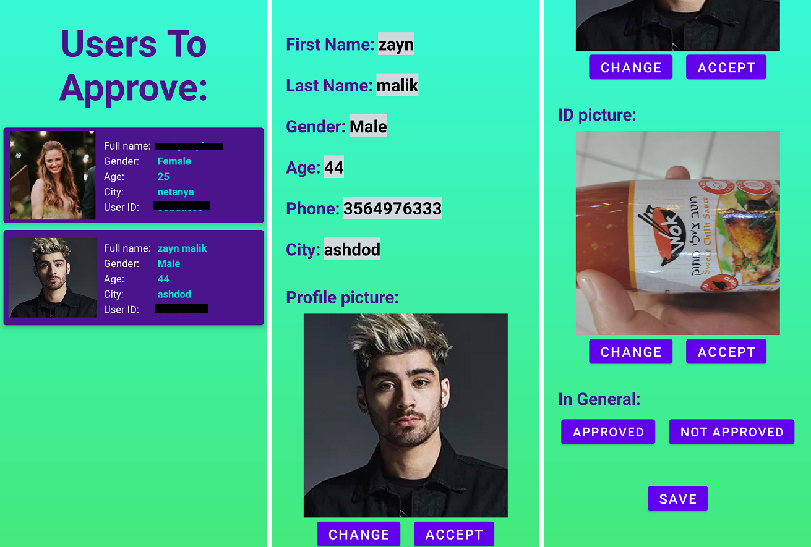

# SeekingBabysitterApp

Final project in an app development course.  

The app shows a list of babysitters who registered, were reviewed and approved by the manager, that way anyone whos looking for a babysitter can be sure that the babysitter is a real person.  

## App description:
The app contains a MainActivity and Fragments and uses a Navigation Graph to navigate between destinations. 
The RecyclerViews contains several MaterialDesignCardView for each User added with the help of an Adapter. 
To transfer the selected User from the RecyclerView between the fragments or after the LOGIN, I used the Safe Args wich transferd a JsonString of the User from one Fragment to another. 
The app uses Firebase Authentication for the registration, Firebase Realtime Database for storing the data of every user and Firebase Storage for the images uploaded. 

In the Home Fragment - 3 buttons: 
* APPLAY as a Babysitter. 
* SEARCH for a babysitter(A search by gender and city). 
* LOGIN after veryfing email. 

  

If the MANAGER logged in - 2 buttons: 
* SEARCH for a babysitter(A search by gender and city) - same as the above. 
* MANAGER - loads a list of users to be reviewed. 

If a USER logged in - 2 buttons: 
* SEARCH for a babysitter(A search by gender and city) - same as the above. 
* UPDATE - loads the information of the user, remarks from the manager are visible and can update the information. 

## Created with:
* Android studio: Kotlin.
* Android version: 12
* SDK version: 31
